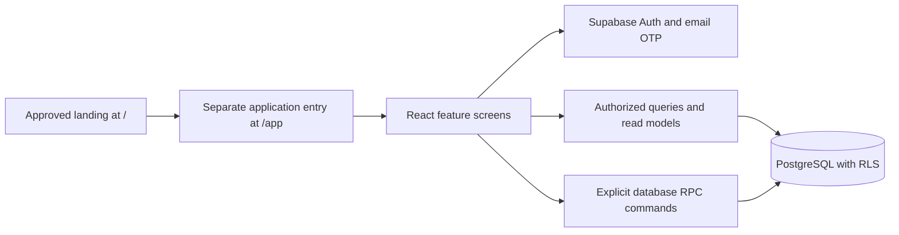
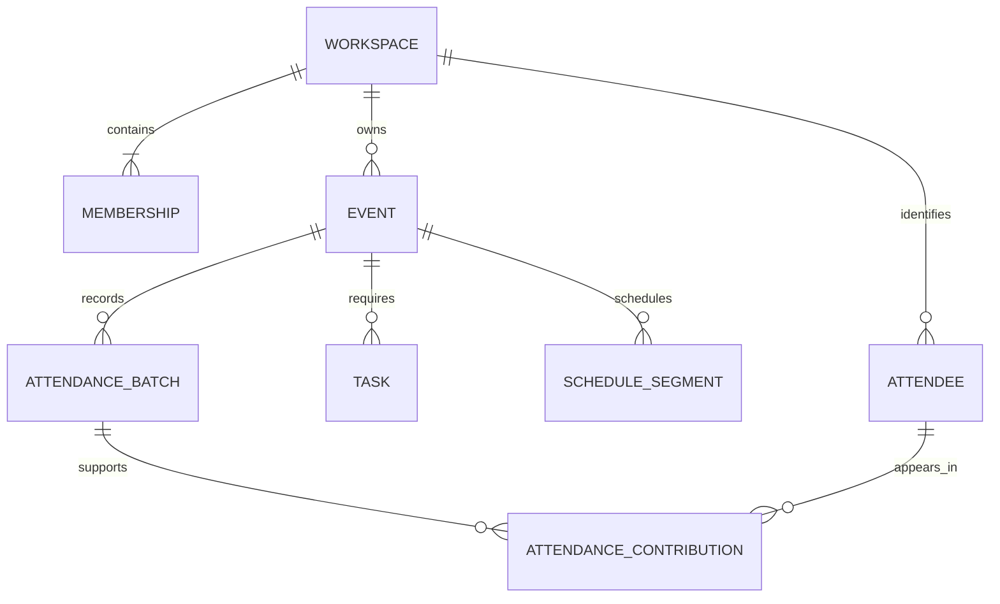

# Brie MVP architecture and data contract

## Starting point and decisions

The repository currently has React 19, TypeScript, Vite, Tailwind, and a public landing page. There is no existing application router, authentication, database, or API. Keep the current frontend; do not migrate to Next.js or redesign marketing as part of this work.

Use a React SPA under `/app`, React Router for URLs, a small feature-oriented data-access layer, and Supabase Auth + PostgreSQL + its generated API. Use TanStack Query for server-state caching and invalidation; plain React state for unsaved forms. Pin compatible versions during each installation slice and consult primary documentation then; this plan does not assert unverified future API signatures.

Supabase is selected for integrated auth and PostgreSQL authorization with a documented self-host path. It can run through Docker for self-hosting; the local CLI development stack is distinct from production hosting. Self-host operators own backups and maintenance. These are platform facts; Brie's single-workspace UX is independent of deployment mode. [Official self-hosting documentation](https://supabase.com/docs/guides/self-hosting)

Sign-in uses Supabase email OTP with a configured SMTP transport. This is authentication infrastructure, not an event email integration. Owner-created invitation links are copied and shared manually; no invitation delivery service is needed. [Official email sign-in documentation](https://supabase.com/docs/guides/auth/auth-email-passwordless)

### Boundaries



- Browser receives only public Supabase endpoint/key and authenticated session. Never ship service-role keys or SMTP credentials to Vite variables.
- Reads use RLS-protected tables/views; privileged aggregate views expose only intentional fields. Writes use specific RPC commands with field allowlists, role checks, version checks, and transactions. Do not allow browser direct write grants to bypass those rules.
- Enable RLS and restrictive grants on every exposed table. Check membership on each request rather than trusting a role encoded at login. Views must not accidentally bypass RLS. [Official RLS documentation](https://supabase.com/docs/guides/database/postgres/row-level-security)
- Default functions to security invoker. Where a narrow security-definer function is necessary (workspace bootstrap, role transition, safe aggregate), set a fixed empty search path, fully qualify tables, revoke public/anonymous execute, explicitly authorize caller and requested workspace, and return only allowed fields. Database functions are the transactional command boundary. [Official function documentation](https://supabase.com/docs/guides/database/functions)
- No microservices, queue, object storage, realtime subscriptions, or generic integration bus in MVP. CSV size caps allow a bounded synchronous preview/commit; measure and reduce limits if the transaction budget cannot be met. Do not invent a background import worker before it is needed.

### Proposed layout

```text
src/App.tsx                    existing landing, unchanged
src/components/*              existing marketing components, unchanged
src/styles.css                existing marketing style tokens, unchanged
src/main.tsx                  mount router instead of landing directly
src/app/router.tsx            lazy application routes; / mounts existing App
src/app/AppShell.tsx
src/app/app.css               scoped application tokens
src/app/components/           buttons, fields, table, panel, menu, states
src/app/features/auth/
src/app/features/workspaces/
src/app/features/events/
src/app/features/tasks/
src/app/features/schedule/
src/app/features/attendance/
src/app/data/                 client, typed queries/RPC wrappers, error mapping
supabase/migrations/          ordered schema, constraints, functions, policies
supabase/tests/               database/authorization/import integration tests
tests/e2e/                    complete workflow and mobile behavior
docs/                         setup, operations, architecture, implementation
```

## Relational model

UUID primary keys unless noted. Mutable business tables have `created_at`, `updated_at`, integer `version` (starts at 1), and actor references where applicable. Timestamps use `timestamptz`; event zone is a separate IANA string. Foreign IDs supplied by the browser are never sufficient authorization.

| Entity | Fields beyond common fields | Constraints and purpose |
| --- | --- | --- |
| `profiles` | `user_id` PK → auth.users, `display_name` | Authenticated self-edit display name only; teammate projections expose name, not arbitrary account data |
| `workspaces` | `id`, `name`, `timezone` | Name 1–80 chars; valid IANA zone; one active owner membership enforced transactionally |
| `memberships` | `id`, `workspace_id`, `user_id`, `role` owner/organizer/member, `joined_at`, `removed_at` | Unique active `(workspace_id,user_id)`; at most one active owner via partial unique index; commands prevent zero owners |
| `invitations` | `id`, `workspace_id`, `email_normalized`, `role`, `token_hash`, `expires_at`, `accepted_at`, `revoked_at`, `created_by` | Organizer/member only; random ≥256-bit token, store hash only; 7-day expiry; one outstanding invite per workspace/email, replace by revoking old |
| `events` | `id`, `workspace_id`, `title`, `description`, `location`, `starts_at`, `ends_at`, `timezone`, `lead_membership_id?`, `status`, `archived_at?`, `created_by` | End > start; title 1–120 chars; role-restricted mutation; lead belongs to workspace |
| `tasks` | `id`, `workspace_id`, `event_id`, `title`, `notes`, `assignee_membership_id?`, `due_date?`, `status`, `removed_at?`, `created_by` | Title 1–200 chars; status todo/done after migration 0019; workspace matches event and assignee; date has no time |
| `schedule_segments` | `id`, `workspace_id`, `event_id`, `title`, `starts_at`, `ends_at`, `instructions`, `removed_at?` | End > start; title 1–120; overlaps/out-of-event times are warnings |
| `schedule_segment_people` | `workspace_id`, `segment_id`, `membership_id` | Composite foreign keys keep each assignment in one workspace; zero rows means Everyone; former members remain attributed but cannot be newly assigned |
| `attendees` | `id`, `workspace_id`, `email_normalized`, `display_name?`, `created_at` | Unique workspace + normalized email; not linked automatically to auth users or memberships; no cross-workspace identity |
| `import_previews` | `id`, `workspace_id`, `event_id`, `created_by`, `expires_at`, `attendance_version`, `parser_version`, `mapping`, `file_label`, `file_hash`, `accepted_rows`, `outcome_counts`, `row_outcomes`, `skip_invalid_ack` | Server-generated normalized snapshot; 24h expiry; creator-only within organizer permission; max file/row/field limits; no raw CSV |
| `attendance_batches` | `id`, `workspace_id`, `event_id`, `created_by`, `committed_at`, `file_label`, `file_hash`, `parser_version`, `outcome_counts`, `idempotency_key`, `preview_id`, `reverted_at?`, `reverted_by?`, `version` | Unique workspace + idempotency key; unique preview ID; committed receipt metadata immutable except reversion fields |
| `attendance_contributions` | `id`, `workspace_id`, `event_id`, `batch_id`, `attendee_id`, `source_row_number` | Unique batch + attendee; one evidence row for each accepted unique identity in batch; append-only; composite FKs keep batch/event/person in one workspace |
| `event_attendance_revisions` | `workspace_id`, `event_id` PK, `version` | Increment under lock on each commit/reversion; stale previews/impact confirmations rejected |
| `audit_entries` | `id`, `workspace_id`, `actor_user_id?`, `action`, `entity_type`, `entity_id`, `occurred_at`, `safe_metadata` | Internal append-only record of role/invite/import/reversion/archive/restore actions; never raw PII/file contents; no generic activity-feed UI |

Use a unique `(workspace_id,id)` key where required for composite foreign keys. Task/segment/event assignees reference memberships rather than users to preserve former membership attribution. Removal retains the membership row; open-task assignee filters treat removed membership as Unassigned, while detail shows Former member. New assignments require active membership. Rejoining creates a new membership; it does not reactivate historic assignments.

The owner invariant needs both the partial unique index and transaction logic: lock workspace on membership mutations; ownership transfer temporarily changes roles inside a transaction, leaving exactly one on commit. Reject removal/demotion without a valid transfer. Workspace creation with first owner is one authorized RPC transaction.

### Relationships



### Attendance is a read model, not a mutable counter

An attendance record exists for `(workspace_id,event_id,attendee_id)` if at least one contribution belongs to a batch with `reverted_at IS NULL`. Event totals count distinct attendees in that relation; person totals count distinct events. Archive/status never removes contributions. No persisted total is updated independently of this predicate.

Example: batch A has Ana and Bo; batch B has Bo and Cy. Event count is 3. Revert A: Bo remains because B supports it; count becomes 2. Revert B: count becomes 0. Reimporting a corrected file creates a new batch. Reverting an already-reverted batch is an idempotent no-op with the original receipt.

Names are display data, email the identity key. Normalize trim/lowercase, retain plus tags/dots. First committed valid name is retained (empty remains empty in MVP); later names do not overwrite it. Do not fuzzy-match names, infer attendance from membership, or link attendee records across workspaces. Corrections to names/identity are intentionally limited in MVP; document the limitation to pilot organizers.

## Commands and concurrency

These names are proposed application contracts, not assertions about existing code. RPCs validate lengths, enums, time ranges, active membership, archive/status rules, and composite ownership. Return typed error codes `UNAUTHENTICATED`, `UNAVAILABLE`, `FORBIDDEN`, `VALIDATION`, `CONFLICT`, `PREVIEW_EXPIRED`, or `LIMIT_EXCEEDED` with safe field errors.

| Command | Inputs / atomic result |
| --- | --- |
| `create_workspace` | name, zone, display name, request key → workspace + owner membership; request key protects retry |
| `create_invitation` / `revoke_invitation` / `accept_invitation` | email/role or token; validate caller and authenticated verified email; accept one time under lock |
| `change_member_role` / `remove_member` / `transfer_ownership` | target membership, expected version; lock workspace, enforce owner invariant |
| `save_workspace` | allowed fields + version → updated settings |
| `create_event` / `update_event` | form fields; updates require expected version; client request key for creation |
| `archive_event` / `restore_event` / `duplicate_event` | source and version/new dates; duplication copies plan atomically and uses request key |
| `save_task` / `set_task_status` / `remove_task` / `restore_task` | task fields/version; member status command checks current assignee and allows only status |
| `save_segment` / `remove_segment` / `restore_segment` | fields/version; server computes overlap/out-of-range warning result for acknowledged save |
| `prepare_attendance_import` | mapped row strings, row numbers, file metadata → validated preview + counts + current attendance revision |
| `commit_attendance_import` | preview ID, skip-invalid acknowledgment, idempotency key → immutable receipt; authoritative counts |
| `preview_revert_import` / `revert_attendance_import` | batch ID, expected batch/event revision → impact preview / transactional reversion |

Use row version predicates for writes; zero updated rows means conflict, not success. Creation commands have request keys to avoid duplicate events/tasks/segments on retries. No general `update(any JSON)` endpoint. New assignments cannot select removed members, including if removal happens between opening the picker and saving.

Implemented concurrency boundary (migration 0016): event/task/schedule/settings mutations and attendance previews lock the workspace before checking permissions, request keys and input references. Attendance commit/reversion and membership administration share that lock. This prevents queued writes from authorizing against pre-removal roles or assigning removed teammates, and keeps preview counts on a coherent revision. Writes within one workspace serialize; separate workspaces retain independent locks. See [data reliability evidence](DATA_RELIABILITY.md) for simultaneous-session tests and measured import costs.

### Import algorithm

1. Parse UTF-8 CSV in browser with a maintained parser, never `split(',')`. Preserve original logical record number for user-facing errors, including multiline quoted fields. Reject malformed CSV/invalid encoding rather than repairing silently. Count blank records separately; trim fields, bound email to 254 chars and name to 200; do not transmit ignored columns.
2. Send mapped name/email rows and metadata to preview RPC. Server independently checks caps and validates email, required fields, normalization, and first-valid-row duplicate rules. Never trust browser counts or the browser claim that a row is valid. Metadata includes SHA-256 of local raw bytes for duplicate-file hint; hash is not an authorization or idempotency mechanism.
3. Server takes a coherent event-attendance revision snapshot while building the preview. Validate role, event unarchived and not canceled. Compute existing people/new people, within-file duplicates, invalids, and accepted rows. Save bounded normalized preview, expiring in 24 hours. Original file is never uploaded or retained. Preview data is still PII and receives the same access restrictions as attendance.
4. Counts partition nonblank data rows: accepted unique rows (new attendance + already-recorded), later duplicate rows, invalid rows. Blank rows are separately ignored. Example: 100 nonblank = 70 new attendance + 20 already-recorded + 6 within-file duplicates + 4 invalid. Commit adds 90 contributions and increases distinct attendance by 70. Button says Record attendance for 90 people; receipt reports 70 added / 20 already recorded / 10 skipped.
5. On confirm, authenticate creator and current role; check preview expiry and invalid-row acknowledgment. Lock event revision row and relevant active membership rows in a consistent order (workspace, membership, event revision, batch). Role/archive mutations use compatible locking so they cannot race the authorization decision. If revision changed, reject with CONFLICT and new-review instruction before writing.
6. Upsert identities by `(workspace,email)` without changing existing names. Insert receipt and contributions atomically; increment attendance revision. Prevent both repeated preview commit and repeated idempotency key. Repeated request with same key/content returns the same receipt; key reused for different input is an error. No partial accepted-set commit.
7. Remove preview payload on successful commit, retaining its ID/reference for idempotency. Store aggregate receipt outcomes and source row numbers, not invalid-row emails. Row-level validation detail is available during preview; after commit receipt shows aggregate skipped counts and reasons, not a permanent copy of rejected rows.
8. A timeout may have committed: look up receipt by preview/key before resubmitting. Reload an unexpired preview by ID for the same creator; an expired preview must be recreated from the local file. Purge expired previews daily using a documented operator-scheduled database maintenance command; filter expired payloads from all reads immediately.

File-identical active batch: show existing receipt in preview and allow an explicit new batch if the user still wants to record it; it adds evidence but no new distinct attendance. This is deliberate and visible. Idempotency protects retries, whereas file hashing helps the user recognize intentional reimports.

### Reversion algorithm

Compute impact under the same event revision: count people whose only active contribution is the target batch; count those supported by another batch. Confirmation submits that revision and batch version. Lock, recheck permission/archive state and versions, set reverted timestamp/actor, increment event revision, append audit entry, commit. Do not delete people or other contributions. History uses active contributions immediately. A subsequent correction is a new import; there is no unrevert command.

## Queries, caching, and performance

- Query keys always include workspace, entity, filters, and page. On workspace switch/sign-out/removal clear scoped queries; do not show previous workspace data while loading the next. Refetch on window focus and after relevant writes; no live-collaboration claims.
- Use server-side pagination (50 rows), filtering, and aggregates. Stable ordering includes ID as tiebreaker. URL filters are validated and bounded. Debounce search around 250ms; cancel/ignore superseded responses.
- Index active membership lookup `(user_id,workspace_id)`; events `(workspace_id,archived_at,starts_at,id)`; tasks `(workspace_id,assignee_membership_id,status,due_date,id)` plus event ID; segments `(workspace_id,event_id,starts_at,id)`; batches `(workspace_id,event_id,committed_at,id)`; contributions `(workspace_id,event_id,attendee_id,batch_id)` and attendee lookup; attendees unique email plus indexed normalized name/email prefix lookup. Use case-insensitive prefix search in MVP; UI says “Search names or emails.”
- Attendance summary available to members is an authorized scalar/count projection, never an unrestricted attendance view. Detailed attendee queries and import endpoints require owner/organizer.
- Time-zone conversion happens in a shared utility plus server validation. Store UTC instants; display event zone, abbreviation and offset when ambiguous. History filters use event-local dates. Test overnight events and both daylight-saving boundaries.
- Candidate budgets on documented local staging hardware: ordinary paginated reads p95 <750ms; 5,000-row preview/commit each <10s. Measure at fixture scale; report hardware/network and adjust limits if needed. These are acceptance targets, not guarantees.

## Security, operations, and open-source release

- User content is plain text, rendered escaped. Never render imported HTML. Validate return URLs against the app origin. Keep invitation tokens out of logs/referrers; immediately exchange/remove token from visible URL after acceptance; avoid third-party scripts on `/app`.
- Auth configuration uses allowlisted redirects, expiring codes, resend/rate limits, and generic email responses. Production SMTP and HTTPS are setup prerequisites. A development mailbox is local only.
- App sign-out clears session and query caches; browser storage must not contain CSV payloads. Session storage follows provider practices; mitigate XSS with scoped content security policy and no arbitrary HTML. Do not alter marketing CSP/styles unnecessarily.
- Keep audit metadata minimal: IDs/action/counts, no raw email/name/file content. Sanitize user-supplied file labels and truncate to 120 characters. Error telemetry must redact request payloads, codes, tokens, and attendee identifiers.
- Ship schema migrations, generated database types, deterministic fictional seed data, `.env.example` with placeholders, and local setup documentation. No secrets or real attendee fixtures committed. Default telemetry off.
- Proposed code license: AGPL-3.0-only, clearly marked as a release decision for maintainers before publishing; do not silently add license terms during planning. Audit asset/dependency licenses separately; preserve vineyard asset attribution/provenance. Do not distribute Helvetica Neue font files.
- Release runbook: production Docker Supabase or documented managed equivalent; static frontend host routes `/app/*` to app entry and keeps `/` intact; pin tested image/package versions. Document migrations, SMTP, redirect URLs, backup/restore, preview cleanup, and upgrades. No automatic deployment in implementation slices.
- Back up database daily and verify a restore into a separate instance with sample data. Explain operator responsibility and configurable retention. Product MVP has no account/workspace erasure screen; provide an operator runbook for scoped permanent purge of identities, contributions, previews and relevant auth data, with impact preview and backup-retention explanation. Reversion/archive are not privacy erasure. A member in multiple workspaces must not be deleted globally to remove one workspace’s data.

## Tests that protect the model

Database integration tests with real roles must cover cross-workspace IDs, anonymous access, member attendee access denial, safe aggregate access, self-assignment/status escalation, role removal during save, owner invariants, invitation email mismatch/expiry/replay, RLS-safe views, and direct-write denial.

Import tests: quoted commas/newlines/BOM, malformed encoding, header-only CSV, max limits, row partition totals, plus-address preservation, case duplicates, conflicting names, repeated key, repeated preview, concurrent commits, stale previews, transaction rollback, timeout receipt recovery, overlapping batch reversion, repeated reversion, canceled/archived rejection, expired preview and cleanup. Assert database effects, not only mocked UI responses.

Time tests: overnight event, ambiguous/missing local times, event-zone due dates, duplication offsets, and out-of-range schedule warnings. Browser tests complete the release demonstration from [MVP.md](../MVP.md) and verify keyboard/mobile states. Avoid duplicating every CSS token in snapshot tests.
